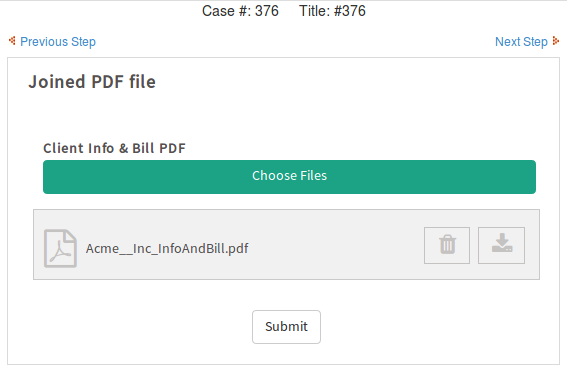

## Joining two Output Documents in one file 

Author: Amos Batto (amos@processmaker.com)  
Created: 2018-04-05 (version 1)  
Tested in: PM 3.2.1 Community in Debian 8.4 with PHP 5.6.20 and Poppler 0.26.5  
License: Public domain  

This example shows how to join two generated Output Document PDF files in 
one PDF that is then added as an Input Document file in the current case.
This joined PDF file is also added to a MultipleFile field so that it
can be displayed in a DynaForm.

In this example, the [PMFGenerateOutputDocument()](http://wiki.processmaker.com/3.1/ProcessMaker_Functions#PMFGenerateOutputDocument.28.29) function is used in a trigger 
to generate the two PDFs, but these two Output Document files can also be generated by 
Output Document steps in a task. Then, [executeQuery()](http://wiki.processmaker.com/3.1/ProcessMaker_Functions#executeQuery.28.29) is used to query the 
APP_DOCUMENT table for the records of the generated Output Document files in order to create the paths
to where these files are stored on the server.

An [external program](https://stackoverflow.com/questions/2507766/merge-convert-multiple-pdf-files-into-one-pdf) needs to be installed on the ProcessMaker server to
join the two PDF files, such as Poppler's `pdfunite`, `pdfjoin`, `convert` or `gs`, 
which are common commands on Linux systems. If using a Windows server, it is
recommended to install [Poppler for Windows](https://sourceforge.net/projects/poppler-win32/). 

First, create a process with two Output Documents and one Input Document which will hold the joined PDF file.

Second, create a trigger with the following code:
```php
$outDoc1Id = "5784874685ac7ea5febd611022221969"; //set to ID of Output Document 1
$outDoc2Id = "7324190235ac7ea78a4df60022265728"; //set to ID of Output Document 2
$joinedInpDocId = '1526387325ac7ea8dbdb153081079371'; //set to ID of Input Document
//set to name of MultipleFile field's ID and variable, which is the same in this example:
$joinedFileVariableName = 'clientInfoAndBillPdf'; 
//set to the name of the joined file:
$joinedFilename = preg_replace('/[^a-zA-Z0-9]/', '_', @@clientName) . '_InfoAndBill'; 

//not necessary to generate these if the Output Documents already exist in the case: 
PMFGenerateOutputDocument($outDoc1Id);
PMFGenerateOutputDocument($outDoc2Id);

//get the records of the generated Output Document files from the database:
$caseId = @@APPLICATION;
$sql1 = "SELECT * FROM APP_DOCUMENT WHERE APP_UID='$caseId' AND APP_DOC_STATUS='ACTIVE' 
   AND DOC_UID='$outDoc1Id' ORDER BY APP_DOC_INDEX DESC";
$sql2 = "SELECT * FROM APP_DOCUMENT WHERE APP_UID='$caseId' AND APP_DOC_STATUS='ACTIVE' 
  AND DOC_UID='$outDoc2Id' ORDER BY APP_DOC_INDEX DESC";

$aDoc1Result = executeQuery($sql1);
$aDoc2Result = executeQuery($sql2);

if (count($aDoc1Result) == 0 or count($aDoc2Result) == 0) {
   throw new Exception("Unable to find case's Output Documents files in the APP_DOCUMENTS table"); 
}

$g = new G();
$doc1Path = PATH_DOCUMENT. $g->getPathFromUID($caseId) .PATH_SEP. 'outdocs' .PATH_SEP. 
   $aDoc1Result[1]['APP_DOC_UID'] .'_'. $aDoc1Result[1]['DOC_VERSION'] .'.pdf';
$doc2Path = PATH_DOCUMENT. $g->getPathFromUID($caseId) .PATH_SEP. 'outdocs' .PATH_SEP. 
   $aDoc2Result[1]['APP_DOC_UID'] .'_'. $aDoc2Result[1]['DOC_VERSION'] .'.pdf';   

$joinedFilePath = tempnam(sys_get_temp_dir(), "joined_") . ".pdf";

//join the two PDFs in 1 file:
//if using Windows, need to include the path to the pdfunite command:
exec("pdfunite $doc1Path $doc2Path $joinedFilePath", @=aOutput);

//upload the joined PDF file as an Input Document to the current case:
$joinedFileId = PMFAddInputDocument($joinedInpDocId, null, 1, 'INPUT', '', 'Add',
   @@APPLICATION, @%INDEX, @@TASK, @@USER_LOGGED, 'file', $joinedFilePath);
   
//Delete the temporary joined PDF file from the server's file system:
unlink($joinedFilePath);

if (empty($joinedFileId)) {
   throw new Exception("Unable to upload joined file '$joinedFilePath' to case.");
} 

//if needing to display the joined PDF file in a MultipleFile field, 
//then set its variable in the case:
$aJoinedFile = array(array(
   'appDocUid' => $joinedFileId,
   'version'   => 1,
   'name'      => $joinedFilename .'.pdf'
));
PMFSendVariables($caseId, array($joinedFileVariableName => $aJoinedFile));

//Also need to associate the joined file with the MultipleFile field 
//by setting the field name of the MultipleFile in the file's record in
//APP_DOCUMENT.APP_DOC_FIELDNAME in the database. In this example, 
//assuming that the MultipleFile's ID and variable name are the same.
$oAppDoc = new AppDocument();
$aJoinedInfo = $oAppDoc->Load($joinedFileId, 1);

//Set to the ID of the MultipleFile field:
$aJoinedInfo['APP_DOC_FIELDNAME'] = $joinedFileVariableName; 
$aJoinedInfo['APP_DOC_FILENAME']  = $joinedFilename .'.pdf';

//save changes to the APP_DOCUMENT record in the database:
$oAppDoc->update($aJoinedInfo);
```

This trigger code will show the joined PDF in a MultipleFile field in a subsequent DynaForm in the process.

Attached is the ["Join two Output Document PDFs in one" process](Join_two_Output_Document_PDFs_in_one-1.pmx) that can be used 
to test this code.

After filling out two DynaForms, the "Join 2 Output Document PDFs in 1" trigger
will generate a joined PDF, so it can be displayed in the next DynaForm:



